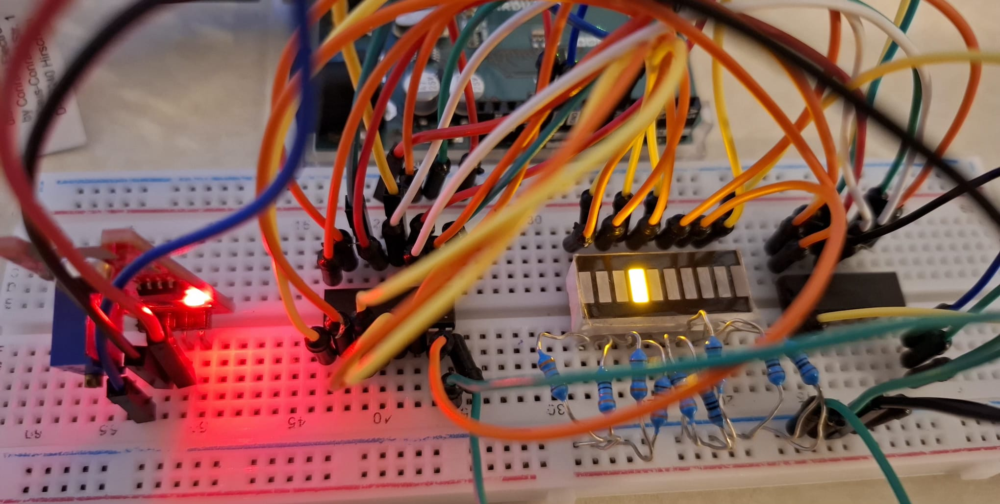
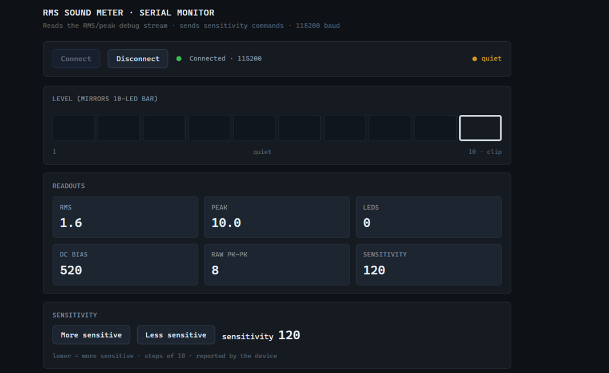

# arduino_rms

An Arduino sound level meter. It samples an electret microphone module at 8 kHz,
computes a running RMS, and shows the level on a 10-segment LED bar graph driven
by two cascaded 74HC595 shift registers. A browser page built on the Web Serial
API displays the same data live and lets you change the sensitivity without
opening the Arduino IDE.



## What it does

The meter computes true RMS rather than peak or envelope amplitude. It keeps a
128-sample sliding window, which is 16 ms at 8 kHz, and updates the sum of
squares incrementally, so each new sample costs the same no matter how long the
window is.

The microphone module sits on a bias of roughly 2.5 V. A first-order IIR high
pass tracks that bias and subtracts it, so the circuit needs no coupling
capacitor and corrects itself when the supply drifts.

One LED floats above the solid bar at the recent maximum. It holds there for 2
seconds, then falls at 4 segments per second.

Sensitivity changes at runtime over the serial link, so you can adapt to a
different room without reflashing.

Every 250 ms the firmware prints the raw peak-to-peak swing and the current DC
estimate, then tags the line `[MIC DEAD? A0 flat]`, `[quiet]` or
`[signal alive]`. When the display stays dark, that tag tells you whether the
microphone has failed or the room is just quiet.

## Hardware

| Part | Notes |
|---|---|
| Arduino Uno (ATmega328P, 16 MHz) | Any 5 V AVR board with an ADC works |
| KY-038 sound sensor module | Analog output only. The digital threshold pin is unused |
| 2 x 74HC595 | Cascaded, 16 outputs, 10 of them used |
| 10-segment LED bar graph | |
| 10 current-limiting resistors | 220 to 470 ohm, depending on how bright you want it |

### Pin map

| Signal | Arduino pin | 74HC595 pin |
|---|---|---|
| Audio in | A0 | |
| DATA (SER) | D11 | 14 |
| CLOCK (SRCLK) | D13 | 11 |
| LATCH (RCLK) | D10 | 12 |

D13 also drives the onboard LED on the Uno, so it flickers along with the shift
register clock. That is expected and harmless.

The schematic is in `circuit_diagram.png`. The KiCad project is under
`kicad_arduino_rms/circuit_diagram_arduino_rms/`.

## Repository layout

```
codes/
  firmware/firmware.ino          Main meter firmware
  rms-meter-monitor.html         Web Serial browser monitor
  backup/                        Duplicate of the above. See Known issues
    ky-038_calibration/          Standalone microphone diagnostic sketch
    led_bar/                     Standalone shift register and LED bar test
docs/
  setup.jpg                      Photo of the assembled hardware
  gui.png                        Screenshot of the browser monitor
kicad_arduino_rms/               KiCad schematic project
presentation/                    Project presentation slides
circuit_diagram.png              Rendered schematic
footer.png                       Slide asset used by the presentation
manual.docx                      User manual
contribution_statement.docx      Author contribution statement
```

## Getting started

### 1. Check the hardware first

Bring the two halves up separately before you run the meter. A dark display is
much harder to debug when either half might be at fault.

`codes/backup/led_bar/led_bar.ino` lights the segments 0 to 10 in sequence. If
any segment stays off, the problem is in the shift registers or the bar graph
wiring.

`codes/backup/ky-038_calibration/ky-038_calibration.ino` stays silent for 3
seconds to measure the noise floor, then prints min, max, mean and peak-to-peak
continuously at 115200 baud. A quiet room gives a peak-to-peak in the single
digits and a mean near 512. Clap and it should jump well past 100. If nothing
moves, the fault is in the microphone or its wiring, not the firmware.

### 2. Flash the meter

Upload `codes/firmware/firmware.ino` and open the Serial Monitor at 115200 baud.

### 3. Set the sensitivity

Send `+` for more sensitivity and `-` for less. The default is 120, clamped
between 10 and 1000, in steps of 10.

Inside the firmware, `sensitivity` is a divisor: `level = rms * 10 / sensitivity`.
A smaller number therefore gives a more sensitive meter, and `+` decreases it.
The serial interface hides the inversion, but the variable name reads backwards
from its arithmetic and will confuse anyone reading the source.

### 4. Browser monitor

Open `codes/rms-meter-monitor.html` in Chrome or Edge. Web Serial does not work
in Firefox or Safari. Close the Arduino Serial Monitor first so the port is
free, click Connect, and pick the board. The page parses the debug lines with
tolerant regular expressions and shows RMS, LED count, peak, DC estimate and raw
peak-to-peak. Two buttons send `+` and `-`.



## How it works

### Sampling

`loop()` compares `micros()` against `nextSampleAt` and takes one `analogRead()`
every 125 us. The deadline advances by exactly one period instead of being reset
from the current time, so timing error does not accumulate. If the loop falls
more than four periods behind, which happens whenever a debug line goes out, the
schedule resets to the present. Samples are dropped on purpose, because a burst
of catch-up reads would corrupt the RMS window.

### ADC clock

`ADCSRA` is set to a /32 prescaler, which gives a 500 kHz ADC clock and about 26
us per conversion. The default /128 prescaler runs at 125 kHz and needs roughly
104 us, leaving too little room inside a 125 us budget. Atmel specifies 50 to
200 kHz for full 10-bit accuracy, so the lowest bits are noisier than the
datasheet promises. The bar graph resolves ten steps, so that extra noise does
not limit anything you can see.

### RMS

A circular buffer of 128 `int16_t` holds the samples after DC removal. Each new
sample subtracts the outgoing square from `sumSquares` and adds the incoming
one, so nothing ever loops over the window. The length is a power of two, which
lets the index wrap with a mask instead of a modulo. Worst case `sumSquares`
reaches about 128 x 512^2, or 3.4e7, well inside a `uint32_t`.

### Display

Every 25 ms the RMS is scaled to a level between 0 and 10, rounded to a segment
count, turned into a bit pattern, and shifted out MSB first as two bytes. The
peak marker is OR-ed in only when it sits strictly above the solid bar. Peak
decay is computed from elapsed milliseconds rather than per frame, so jitter in
the display loop does not change the fall rate.

## Design parameters

| Constant | Value | Meaning |
|---|---|---|
| `SAMPLE_RATE_HZ` | 8000 | 4 kHz usable bandwidth |
| `BUF_LEN` | 128 | 16 ms RMS window. Must stay a power of two |
| `DISPLAY_PERIOD_MS` | 25 | 40 Hz refresh |
| `PEAK_HOLD_MS` | 2000 | Marker freeze before decay |
| `PEAK_DECAY_PER_SEC` | 4.0 | Segments per second |
| `sensitivity` | 120 | Divisor. Lower means more sensitive |
| `SERIAL_DEBUG` | true | Set false to remove all serial output |

## Limitations

The output is not calibrated in dB SPL. It is a relative RMS in ADC counts with
no weighting curve. Real decibels would need a reference sound source and a
known microphone sensitivity, and without A-weighting the response does not
follow how people actually hear loudness.

Usable bandwidth stops at 4 kHz. Anything above that folds back into the
measurement band, and the KY-038 has no anti-aliasing filter.

Serial debug output disturbs the sampling. A debug line at 115200 baud takes
several milliseconds to send and blocks once the 64-byte transmit buffer fills,
so a few samples vanish every 250 ms. Set `SERIAL_DEBUG` to false for the
cleanest measurement.

`shiftOut()` bit-bangs 16 bits with `digitalWrite()`, which is slow on an AVR,
and the call very likely overruns a single 125 us sample slot. It only fires
every 25 ms, so the duty is low and the sampler resyncs afterwards, but the cost
has not been measured. Hardware SPI would remove the question entirely.


## Coursework context

Built for the Complex Embedded Systems lab, MSc Micro- and Nanotechnology,
Technische Universität Ilmenau.Operating instructions are in `manual.docx`.
